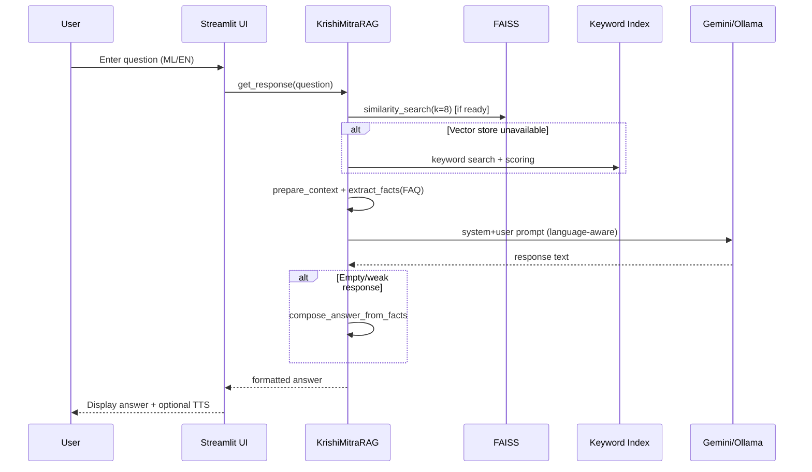
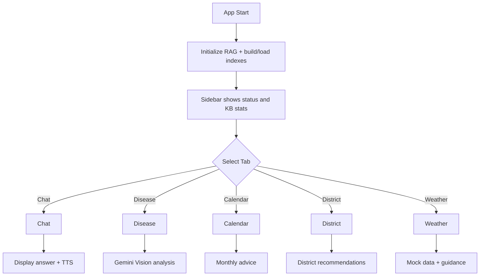

# KrishiMitraAI — Kerala Farmers' AI-Powered Agricultural Advisor

An end-to-end Streamlit application that provides Kerala-specific agricultural advice using a hybrid RAG (Retrieval-Augmented Generation) system, seasonal crop calendar, district-wise advisory, weather-based guidance, and optional voice features. Supports Malayalam and English.

---

## Highlights
- Chat with an AI advisor grounded in Kerala Agricultural Development Policy (PDF) and a curated FAQ dataset (CSV)
- FAISS vector search with multilingual sentence-transformer embeddings and keyword fallback index
- Optional local LLM via Ollama; default cloud LLM via Gemini
- Crop disease image analysis using Gemini Vision
- Seasonal calendar with month-wise crops, activities, and tips
- District-wise advisory: crops, soils, schemes, and recommendations
- Weather advisory with mock Kerala patterns and actionable guidance
- Voice input/output using browser Web Speech API (no backend dependency)

---

## Project Structure
```text
KrishiMitraAI/
├─ app.py                      # Streamlit UI and app entrypoint
├─ rag_system.py               # RAG pipeline (FAISS + Gemini/Ollama) and image analysis
├─ document_processor.py       # PDF/CSV ingestion and chunking
├─ utils.py                    # Language detection, text cleaning/formatting, fallbacks
├─ crop_calendar.py            # Kerala agricultural calendar (month-wise)
├─ kerala_districts.py         # District-wise agri info and tips
├─ weather_integration.py      # Weather-based advisory (mock data)
├─ voice_assistant.py          # Web Speech API integrations for voice I/O
├─ attached_assets/
│  ├─ Agri-Dev-Policy_*.pdf    # Kerala policy PDF (knowledge source)
│  ├─ Farming_FAQ_*.csv        # FAQ dataset (knowledge source)
│  ├─ questionsv4.csv          # Optional additional Q&A
│  └─ index/                   # FAISS index files (auto-built/loaded)
├─ pyproject.toml              # Dependencies (uv/pip compatible)
└─ uv.lock                     # Lockfile (optional)
```

---

## Prerequisites
- Python 3.11+
- Windows, macOS, or Linux
- Internet access for first-time model downloads and Gemini API (unless using Ollama)
- Optional: GPU with CUDA for faster FAISS (auto-detected)

### API Keys
- Gemini: set `GEMINI_API_KEY` in your environment.
  - The code currently contains a placeholder; for production, always use an environment variable.

### Optional: Ollama (Local LLM)
- Install Ollama from `https://ollama.com`
- Pull a compatible model (configured default is `llama2-uncensored:7b`):
```bash
ollama pull llama2-uncensored:7b
```
The app auto-detects Ollama; if not found, it falls back to Gemini.

---

## Setup

### 1) Clone and enter the project
```bash
git clone <your-repo-url>
cd KrishiMitraAI
```

### 2) Create and activate a virtual environment
- Windows (PowerShell):
```powershell
python -m venv .venv
. .venv\Scripts\Activate.ps1
```
- macOS/Linux (bash):
```bash
python3 -m venv .venv
source .venv/bin/activate
```

### 3) Install dependencies
Using pip:
```bash
pip install -U pip
pip install -r requirements.txt  # if you create one
# or install via pyproject
pip install .
```
Or using uv (fast, recommended):
```bash
pip install uv
uv sync
```

### 4) Add data assets
Ensure the following exist under `attached_assets/`:
- `Agri-Dev-Policy_*.pdf` (provided)
- `Farming_FAQ_Assistant_Dataset_*.csv` (provided)
- Optional: `questionsv4.csv`

### 5) Set environment variables
- Windows (PowerShell):
```powershell
$env:GEMINI_API_KEY="YOUR_KEY"
```
- macOS/Linux:
```bash
export GEMINI_API_KEY="YOUR_KEY"
```

---

## Run
Start the Streamlit app:
```bash
streamlit run app.py
```
Then open the provided local URL in your browser.

First launch builds/loads the FAISS index and keyword index in background threads. The sidebar shows build status, device (CPU/GPU), and knowledge base stats.

---

## Usage Guide
- Chat Tab: Ask questions in Malayalam or English. Answers are grounded in the PDF/CSV knowledge base.
- Crop Disease Detection: Upload a crop image and click “Analyze Crop” to get identification and treatment suggestions.
- Seasonal Calendar: Choose a month to see recommended crops, maintenance, irrigation, fertilizer, and disease watch.
- District Advisory: Pick your district (and optionally a crop) to get localized guidance and schemes.
- Weather Advisory: Select a location to view mock real-time weather and actionable recommendations; shows a 3‑day outlook.
- Voice: Expand Voice Input to speak queries; responses can be played via “Listen to Response.”

---

## Architecture

```mermaid
flowchart LR
  subgraph UI[Streamlit UI]
    A[Chat UI]
    B[Image Upload]
    C[Calendar]
    D[District Advisory]
    E[Weather Advisory]
    V[Voice I/O]
  end

  A -- query --> RAG
  B -- image --> IMG[Gemini Vision]
  C --> CAL[KeralaAgriculturalCalendar]
  D --> DIST[KeralaDistrictAdvisory]
  E --> WTH[WeatherAdvisory]
  V --> A

  subgraph Core
    RAG[KrishiMitraRAG]
    DP[DocumentProcessor]
    VS[(FAISS Index)]
    KW[(Keyword Index)]
  end

  RAG <--chunks--> VS
  RAG <--tokens--> KW
  RAG <--docs--> DP

  subgraph External
    GEM[Gemini API]
    OLL[Ollama (optional)]
  end

  RAG <--> GEM
  RAG <--> OLL
```

---

## RAG Flow


---

## Streamlit UI Flow


---

## Configuration Notes
- Embeddings: `sentence-transformers/paraphrase-multilingual-MiniLM-L12-v2` loaded on CPU or CUDA when available.
- Index directory: `attached_assets/index/` (auto-created). Safe to delete; will rebuild on next run.
- Language detection: simple Malayalam/English heuristic in `utils.detect_language`.
- Voice features: implemented via Web Speech API in `voice_assistant.py`; no server-side speech libs required.

---

## Troubleshooting
- Vector store building forever:
  - Ensure `attached_assets` files exist and readable.
  - Delete `attached_assets/index/` and restart to rebuild.
- GPU not used:
  - Requires CUDA and `torch.cuda.is_available()`; otherwise runs on CPU.
- Gemini errors:
  - Verify `GEMINI_API_KEY` is set and valid.
  - Network/firewall may block API; check connectivity.
- Ollama not used:
  - Confirm `ollama list` shows the model. App will fall back to Gemini if unavailable.
- Image analysis fails:
  - Ensure JPEG/PNG is clear and under typical browser upload limits.

---

## Security & Privacy
- Do not commit real API keys. Use environment variables.
- Uploaded images are temporarily saved for processing and then deleted.
- Answers are advisory only; for official guidance, consult local Krishi Bhavan.

---

## Development
- Run in dev mode and iterate on Streamlit components.
- Key modules to tweak:
  - `rag_system.py`: retrieval configs, prompts, and LLM provider.
  - `document_processor.py`: chunk sizes and metadata handling.
  - `app.py`: UI layout and interactions.

---

## License
Specify your license here.
